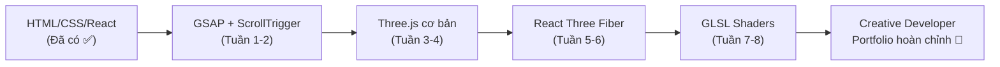

# 🚀 DuongBill Portfolio — Creative Developer Transformation Plan

## Phân tích trang tham khảo: valentingassend.com


### Kiến trúc kỹ thuật của trang tham khảo
| Thành phần | Công nghệ | Vai trò |
|---|---|---|
| Framework | Next.js (React) | SSG + SPA hydration |
| 3D/Shaders | React Three Fiber + Three.js | WebGL effects, image distortion |
| Animation | GSAP + ScrollTrigger | Kinetic typography, timeline |
| Smooth Scroll | Lenis | Đồng bộ cuộn với WebGL/GSAP |
| Page Transitions | Framer Motion / GSAP Timeline | Chuyển trang mượt mà |

---

## Phân tích trang hiện tại: DuongBill

### Hiện trạng
- **Kiến trúc**: Static HTML đơn trang (3351 dòng), Bootstrap 4, jQuery
- **Animation**: AOS (Animate On Scroll) — cơ bản
- **Styling**: Inline `<style>` rất dài (~2000 dòng), `style.css` (2849 dòng)
- **JS**: jQuery plugins (Isotope, Owl Carousel, prettyPhoto)
- **Sections**: Home → About → Projects → Gallery → Weather → News → Contact → Footer

### Vấn đề cần giải quyết
1. Không có 3D/WebGL — trang trông "flat" và thiếu chiều sâu
2. Animation đơn giản (fade-in/out) — không có kinetic typography
3. Cuộn trang mặc định — giật cục, không smooth
4. Chuyển section không có transition — nhảy đột ngột
5. Không có custom cursor — thiếu micro-interactions
6. Code monolithic — khó maintain, không modular

---

## 📋 Kế hoạch chuyển đổi — 4 Giai đoạn

### Giai đoạn 1: Khởi tạo Next.js + Migration (Tuần 1-2)

> [!IMPORTANT]
> Đây là bước nền tảng — chuyển từ static HTML sang Next.js framework

**Mục tiêu**: Setup project mới, migrate nội dung hiện tại

```
Công việc cụ thể:
├── 1.1 Khởi tạo Next.js project
│   ├── npx create-next-app@latest ./duongbill-creative
│   ├── Cấu hình TypeScript (optional), ESLint, Prettier
│   └── Cài đặt dependencies: gsap, @studio-freight/lenis, three, @react-three/fiber
│
├── 1.2 Thiết kế Design System
│   ├── CSS Variables (colors, fonts, spacing)
│   ├── Font: "Be Vietnam Pro" (giữ lại) + thêm font display (Clash Display / Satoshi)
│   └── Color palette: Dark theme (#0a0a0a, #1a1a2e, #59ECFF accent)
│
├── 1.3 Tạo Layout Components
│   ├── components/Layout.jsx (wrapper chung)
│   ├── components/Navbar.jsx (migrate nav hiện tại)
│   ├── components/Footer.jsx
│   ├── components/CustomCursor.jsx ← MỚI
│   └── components/SmoothScroll.jsx (Lenis wrapper) ← MỚI
│
└── 1.4 Tạo Pages (App Router)
    ├── app/page.jsx (Home)
    ├── app/about/page.jsx
    ├── app/projects/page.jsx
    ├── app/gallery/page.jsx
    └── app/contact/page.jsx
```

**Dependencies cần cài:**
```bash
npm install gsap @studio-freight/lenis three @react-three/fiber @react-three/drei framer-motion
```

---

### Giai đoạn 2: GSAP Animations + Smooth Scroll (Tuần 3-4)

> [!TIP]
> Giai đoạn này tạo ra sự khác biệt lớn nhất về trải nghiệm người dùng

**2.1 — Lenis Smooth Scroll**
```
├── Tích hợp Lenis vào Layout
├── Đồng bộ Lenis với GSAP ScrollTrigger
└── RAF loop để cập nhật scroll position
```

**2.2 — Hero Section (Kinetic Typography)**
```
├── Tách "Hello, I'm Duong" thành từng ký tự <span>
├── GSAP stagger animation: chữ "bay" vào từ dưới
├── Parallax effect: text di chuyển khác tốc độ với background
└── Scroll-triggered fade out khi cuộn xuống
```

**2.3 — Section Reveal Animations**
```
├── ScrollTrigger cho mỗi section
├── Text split animation (từng dòng slide lên)
├── Horizontal marquee text (chữ chạy ngang kiểu Valentin)
├── Staggered card reveals cho Projects
└── Progress bar animation cho Skills
```

**2.4 — Custom Cursor**
```
├── Ẩn cursor mặc định
├── Div tròn chạy theo chuột (lerp/easing)
├── Hover state: phóng to + hiện text "View" khi hover project
└── Blend mode: mix-blend-mode: difference
```

---

### Giai đoạn 3: WebGL + Three.js Effects (Tuần 5-7)

> [!WARNING]
> Giai đoạn này đòi hỏi kiến thức GLSL — nên học Three.js cơ bản trước

**3.1 — Project Cards trên WebGL Planes**
```
├── Thay thế  bằng Three.js Planes
├── Áp Texture (hình ảnh project) lên plane
├── Vertex Shader: bóp méo plane theo scroll velocity
├── Fragment Shader: hiệu ứng RGB shift khi hover
└── Scroll velocity → plane curvature (phẳng khi dừng)
```

**3.2 — Background Particles / Noise**
```
├── Canvas toàn màn hình phía sau nội dung
├── Perlin noise animation
├── Phản ứng nhẹ theo vị trí chuột
└── Performance: sử dụng instanced geometry
```

**3.3 — Gallery với WebGL Transitions**
```
├── Image grid render bằng R3F
├── Click → zoom transition (camera dolly)
├── Shader transition giữa các ảnh
└── Dispose textures khi unmount
```

**3.4 — Page Transition Effects**
```
├── Framer Motion AnimatePresence cho route changes
├── Màn che (curtain) WebGL khi chuyển trang
├── Preload trang tiếp theo trong background
└── Clean-up WebGL resources (dispose geometries/materials)
```

---

### Giai đoạn 4: Polish + Performance (Tuần 8)

**4.1 — Tối ưu hiệu năng**
```
├── Lazy load WebGL scenes (Suspense + React.lazy)
├── Image optimization: next/image với WebP/AVIF
├── Code splitting per route
├── GPU offloading: transform thay vì top/left
├── will-change hints cho animated elements
└── Lighthouse audit: target ≥ 90 Performance
```

**4.2 — SEO & Accessibility**
```
├── Meta tags cho mỗi page
├── Open Graph + Twitter Cards
├── Structured data (JSON-LD)
├── prefers-reduced-motion: tắt animation
├── Keyboard navigation cho custom cursor
└── Screen reader support
```

**4.3 — Responsive & Mobile**
```
├── Touch events cho mobile (thay mousemove)
├── Giảm WebGL complexity trên mobile
├── Fallback: CSS-only effects cho low-end devices
└── Test: iPhone SE → iPad → Desktop
```

**4.4 — Deploy**
```
├── Vercel (free, tối ưu cho Next.js)
├── Custom domain: duongbill.com
├── CI/CD: auto deploy từ GitHub
└── Analytics: Vercel Analytics hoặc Plausible
```

---

## 🗺️ Lộ trình học tập



### Tài nguyên học
| Chủ đề | Nguồn | Link |
|---|---|---|
| GSAP ScrollTrigger | GreenSock Docs | gsap.com/docs |
| Three.js Journey | Bruno Simon Course | threejs-journey.com |
| React Three Fiber | Poimandres Docs | docs.pmnd.rs/r3f |
| GLSL Shaders | The Book of Shaders | thebookofshaders.com |
| Creative Dev | Awwwards tutorials | awwwards.com/academy |
| Lenis Scroll | Studio Freight | github.com/darkroomengineering/lenis |

---

## 📊 So sánh Trước vs Sau

| Tiêu chí | Hiện tại | Sau chuyển đổi |
|---|---|---|
| Framework | Static HTML + jQuery | Next.js (React) |
| Animation | AOS (fade basic) | GSAP + ScrollTrigger (kinetic) |
| 3D Effects | Không có | Three.js / R3F + Custom Shaders |
| Scroll | Browser default | Lenis Smooth Scroll |
| Cursor | Mặc định OS | Custom cursor + micro-interactions |
| Page Load | ~3s (nhiều CSS/JS blocking) | <1s (SSG + code splitting) |
| Trải nghiệm | Portfolio thông thường | Creative Developer Portfolio |

---

## ⚡ Quick Wins (Có thể làm NGAY trên trang hiện tại)

Nếu chưa muốn migrate toàn bộ sang Next.js, bạn có thể thêm các hiệu ứng sau vào trang HTML hiện tại:

1. **Lenis Smooth Scroll** — thêm via CDN, ~10 dòng JS
2. **GSAP ScrollTrigger** — thay AOS, mạnh hơn nhiều
3. **Custom Cursor** — ~50 dòng CSS + JS
4. **Text Split Animation** — GSAP SplitText plugin
5. **Parallax Hero** — GSAP ScrollTrigger + yPercent

> [!NOTE]
> Bạn muốn tôi bắt đầu từ đâu? Có 2 hướng:
> - **Hướng A**: Thêm Quick Wins vào trang HTML hiện tại (nhanh, thấy kết quả ngay)
> - **Hướng B**: Khởi tạo project Next.js mới và migrate (đầu tư dài hạn, kết quả tốt hơn)
